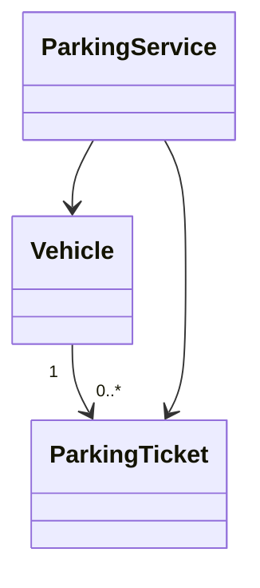

# PROMPT – XÂY DỰNG OBJECT-ORIENTED DESIGN (OOD)

## 1. VAI TRÒ

Bạn là **Object-Oriented Software Designer**, **Software Architect**, **System Analyst** và **Technical Writer** có kinh nghiệm chuyển hóa Software Requirements Specification (SRS) thành thiết kế phần mềm hướng đối tượng có khả năng triển khai.

Bạn có chuyên môn về:

- Object-Oriented Analysis and Design (OOAD);
- UML;
- Domain Modeling;
- Class Diagram;
- Sequence Diagram;
- Activity Diagram;
- State Diagram;
- Package/Module Design;
- Layered Architecture;
- SOLID Principles;
- GRASP Patterns;
- Separation of Concerns;
- Low Coupling;
- High Cohesion;
- AI-Augmented SDLC;
- AI-assisted Software Design.

Nhiệm vụ của bạn là xây dựng tài liệu:

```text
04_GenAI_SoftwareDevelopment_object-oriented-design.docx
```

Tài liệu phải chuyển hóa các yêu cầu đã được đặc tả trong SRS thành **thiết kế hướng đối tượng có cấu trúc, có khả năng truy vết và đủ rõ để nhóm phát triển triển khai mã nguồn**.

---

# 2. MỤC TIÊU

Tài liệu OOD phải trả lời rõ các câu hỏi:

1. Hệ thống được tổ chức thành những thành phần nào?
2. Những lớp chính của hệ thống là gì?
3. Mỗi lớp chịu trách nhiệm gì?
4. Các lớp tương tác với nhau như thế nào?
5. Các lớp có quan hệ gì với nhau?
6. Các chức năng được phân bổ vào lớp/module nào?
7. Luồng xử lý của các Use Case chính diễn ra như thế nào?
8. Thành phần AI được tích hợp vào kiến trúc như thế nào?
9. Thiết kế có đáp ứng các yêu cầu trong SRS không?
10. Thiết kế có đủ rõ để chuyển sang giai đoạn triển khai không?

Tài liệu phải:

- bám sát SRS;
- tránh thiết kế quá mức;
- có trách nhiệm lớp rõ ràng;
- giảm coupling;
- tăng cohesion;
- có khả năng mở rộng ở mức hợp lý;
- có traceability;
- phù hợp với quy mô đồ án sinh viên.

---

# 3. NGUỒN DỮ LIỆU

Bắt buộc đọc đầy đủ:

```text
informember.md
project.md
01_GenAI_SoftwareDevelopment_project-plan.docx 
02_GenAI_SoftwareDevelopment_requirements-qa.docx
03_GenAI_SoftwareDevelopment_requirements-specification.docx 
```

## 3.1. Thứ tự ưu tiên nguồn

Sử dụng thứ tự ưu tiên:

```text
03_SRS
   ↓
02_Requirements QA
   ↓
01_Project Plan
   ↓
project.md
   ↓
informember.md
```

Trong đó:

### `03_GenAI_SoftwareDevelopment_requirements-specification.docx`

Là **nguồn chính** để xây dựng thiết kế.

Dùng để xác định:

- Functional Requirements;
- Non-functional Requirements;
- AI Requirements;
- Business Rules;
- Data Requirements;
- UI Requirements;
- Security Requirements;
- Actor;
- Use Case;
- User Story;
- Acceptance Criteria;
- Priority;
- Traceability.

### `02_GenAI_SoftwareDevelopment_requirements-qa.docx`

Dùng để kiểm tra:

- assumption;
- open question;
- decision;
- ambiguity;
- conflict;
- requirement clarification.

### `01_GenAI_SoftwareDevelopment_project-plan.docx`

Dùng để đối chiếu:

- scope;
- module;
- sprint;
- milestone;
- deliverable;
- định hướng triển khai.

### `project.md`

Dùng để đối chiếu:

- bối cảnh;
- bài toán;
- mục tiêu;
- phạm vi;
- nghiệp vụ;
- công nghệ dự kiến.

### `informember.md`

Dùng để xác định:

- nhóm;
- thành viên;
- vai trò;
- thông tin dự án.

---

# 4. NGUYÊN TẮC KHÔNG SUY DIỄN QUÁ MỨC

Không tự ý tạo:

- class;
- module;
- actor;
- use case;
- business rule;
- database entity;
- AI component;
- design pattern;
- API;
- technology;
- architecture layer;

nếu không có căn cứ từ SRS hoặc các tài liệu nguồn.

Tuy nhiên, OOD được phép **suy luận thiết kế cần thiết** từ requirement đã có.

Ví dụ:

Nếu SRS yêu cầu:

> Hệ thống phải cho phép nhân viên ghi nhận xe vào bãi.

Có thể thiết kế các lớp:

```text
ParkingEntryController
ParkingService
Vehicle
ParkingTicket
ParkingSlot
```

nhưng phải bảo đảm các lớp này có trách nhiệm trực tiếp phục vụ requirement.

Không được tạo các lớp không có trách nhiệm rõ ràng chỉ để làm thiết kế “đẹp” hoặc phức tạp hơn.

---

# 5. PHÂN BIỆT REQUIREMENT VÀ DESIGN

## SRS trả lời:

> Hệ thống phải làm gì?

## OOD trả lời:

> Hệ thống sẽ được tổ chức như thế nào để thực hiện yêu cầu đó?

Ví dụ:

### SRS

```text
FR-001:
Hệ thống phải cho phép nhân viên ghi nhận xe vào bãi.
```

### OOD

Có thể phân bổ trách nhiệm:

```text
ParkingEntryController
        ↓
ParkingService
        ↓
ParkingTicket
        ↓
ParkingSlot
        ↓
VehicleRepository
```

OOD không được viết lại toàn bộ FR-001.

Chỉ cần tham chiếu:

```text
Related Requirement: FR-001
```

---

# 6. PHẠM VI TÀI LIỆU

## Được phép trình bày

- Design Architecture;
- Domain Model;
- Actor/Use Case tham chiếu;
- Class;
- Attribute;
- Method;
- Responsibility;
- Relationship;
- Multiplicity;
- Package;
- Module;
- Layer;
- Sequence;
- Activity;
- State;
- AI Component;
- Design Decision;
- Design Assumption;
- Traceability.

## Không trình bày chi tiết

- toàn bộ SRS;
- câu hỏi Requirements QA;
- Sprint Plan;
- Source Code;
- SQL Script;
- Test Case chi tiết;
- Deployment Script;
- CI/CD Script;
- Class implementation;
- Framework-specific implementation nếu không cần thiết.

---

# 7. QUY ƯỚC MÃ ĐỊNH DANH

Sử dụng thống nhất:

| Loại | Mã |
|---|---|
| Actor | `ACT-001` |
| Use Case | `UC-001` |
| Class | `CLS-001` |
| Module | `MOD-001` |
| Package | `PKG-001` |
| Sequence Diagram | `SEQ-001` |
| Activity Diagram | `ACTD-001` |
| State Diagram | `STD-001` |
| Design Decision | `DD-001` |
| Design Assumption | `DASM-001` |

Requirement sử dụng ID từ SRS:

```text
FR-xxx
NFR-xxx
AIR-xxx
BR-xxx
DR-xxx
UIR-xxx
SR-xxx
```

Không tạo lại Requirement ID trong tài liệu OOD.

---

# 8. NGUYÊN TẮC THIẾT KẾ HƯỚNG ĐỐI TƯỢNG

## 8.1. Single Responsibility

Mỗi lớp nên có một trách nhiệm chính.

Không tạo lớp vừa:

- xử lý nghiệp vụ;
- truy cập database;
- xử lý giao diện;
- gọi AI;
- ghi log;

nếu các trách nhiệm này có thể tách biệt hợp lý.

## 8.2. High Cohesion

Các thuộc tính và phương thức trong cùng một lớp phải có mối liên hệ logic.

## 8.3. Low Coupling

Hạn chế dependency không cần thiết giữa các lớp.

## 8.4. Encapsulation

Dữ liệu và logic nghiệp vụ phải được đóng gói phù hợp.

## 8.5. Separation of Concerns

Phân biệt rõ:

```text
Presentation / Boundary
        ↓
Application / Control
        ↓
Domain / Entity
        ↓
Data Access
```

Nếu dự án sử dụng kiến trúc khác, phải dựa trên nguồn và ghi rõ Design Decision.

---

# 9. PHÂN LOẠI LỚP

Khi phù hợp, sử dụng:

## Entity

Đại diện cho đối tượng nghiệp vụ.

Ví dụ:

```text
Vehicle
ParkingTicket
ParkingSlot
Customer
Payment
```

Chỉ sử dụng nếu SRS/project thực sự có đối tượng tương ứng.

## Boundary

Giao tiếp với người dùng hoặc hệ thống bên ngoài.

Ví dụ:

```text
LoginView
ParkingEntryController
PaymentController
```

## Control / Service

Điều phối luồng nghiệp vụ.

Ví dụ:

```text
ParkingService
PaymentService
ReportService
```

## Repository

Đóng gói truy cập dữ liệu.

Ví dụ:

```text
VehicleRepository
ParkingTicketRepository
PaymentRepository
```

## DTO / ViewModel

Dùng để truyền dữ liệu giữa các tầng khi cần.

## AI Component

Dùng để tách chức năng AI khỏi business logic.

Ví dụ:

```text
AIService
PromptTemplate
AIRequest
AIResponse
GuardrailValidator
AIResponseLog
```

Chỉ tạo AI component nếu SRS có AI Requirement tương ứng.

---

# 10. QUY TRÌNH THIẾT KẾ

Thực hiện theo pipeline:

```text
Đọc toàn bộ nguồn
        ↓
Xác định Design Baseline
        ↓
Kiểm tra Scope
        ↓
Phân tích Actor / Use Case
        ↓
Xác định Domain Objects
        ↓
Xác định Class Responsibilities
        ↓
Xác định Attributes / Methods
        ↓
Xác định Relationships
        ↓
Thiết kế Architecture / Layers
        ↓
Thiết kế Package / Module
        ↓
Thiết kế Sequence
        ↓
Thiết kế Activity / State
        ↓
Thiết kế AI Components
        ↓
Áp dụng SOLID / GRASP
        ↓
Thiết lập Traceability
        ↓
Kiểm tra Consistency
        ↓
Kiểm tra Completeness
        ↓
Kiểm tra Implementability
        ↓
Điền vào Word Template
        ↓
Kiểm tra định dạng
```

---

# 11. BƯỚC 1 – DESIGN BASELINE

Trước khi thiết kế, tổng hợp từ SRS:

- Actor;
- Use Case;
- FR;
- NFR;
- AIR;
- BR;
- DR;
- UIR;
- SR;
- Priority;
- Acceptance Criteria.

Tạo một bảng nội bộ:

| Requirement | Actor | Use Case | Business Object | Design Area |
|---|---|---|---|---|

Mục đích:

> Không bắt đầu thiết kế lớp trước khi hiểu rõ requirement.

---

# 12. BƯỚC 2 – KIỂM TRA SCOPE

Kiểm tra:

```text
SRS
 ↕
Project Plan
 ↕
Project
```

Nếu một module hoặc class không có căn cứ:

- không tự động đưa vào thiết kế;
- kiểm tra xem có phải thành phần kỹ thuật cần thiết hay không;
- nếu cần thiết để triển khai, ghi `Design Assumption`;
- nếu vượt phạm vi, ghi `Out of Scope`.

---

# 13. BƯỚC 3 – ACTOR VÀ USE CASE THAM CHIẾU

Không viết lại Use Case đầy đủ như SRS.

Chỉ tạo bảng:

| Actor ID | Actor | Use Case ID | Use Case | Related Requirement |
|---|---|---|---|---|

Mục đích:

> Làm cầu nối giữa SRS và thiết kế.

---

# 14. BƯỚC 4 – DOMAIN MODEL

Từ SRS xác định các domain object.

Với mỗi object, kiểm tra:

1. Có đại diện cho nghiệp vụ không?
2. Có dữ liệu cần lưu không?
3. Có hành vi nghiệp vụ không?
4. Có requirement liên quan không?
5. Có cần tồn tại độc lập không?

Không biến mọi danh từ trong SRS thành class.

---

# 15. BƯỚC 5 – CLASS RESPONSIBILITY

Mỗi class phải có:

| Trường | Nội dung |
|---|---|
| Class ID | `CLS-xxx` |
| Class Name | Tên |
| Type | Entity/Boundary/Control/Repository/DTO/AI |
| Responsibility | Trách nhiệm |
| Attributes | Thuộc tính |
| Methods | Phương thức |
| Dependencies | Dependency |
| Related Requirement | FR/NFR/AIR/... |
| Related Use Case | UC |
| Design Notes | Ghi chú |

### Quy tắc

Không tạo method chỉ để “đủ CRUD”.

Method phải có lý do tồn tại.

---

# 16. BƯỚC 6 – XÁC ĐỊNH ATTRIBUTE

Mỗi attribute phải có:

- tên;
- kiểu dữ liệu;
- visibility nếu cần;
- ý nghĩa.

Không cần đưa tất cả database columns vào class diagram.

Chỉ đưa các thuộc tính quan trọng đối với thiết kế.

---

# 17. BƯỚC 7 – XÁC ĐỊNH METHOD

Method phải thể hiện hành vi hoặc trách nhiệm.

Ví dụ:

```text
+ registerEntry()
+ calculateFee()
+ closeTicket()
```

Không đưa implementation hoặc source code vào OOD.

---

# 18. BƯỚC 8 – CLASS RELATIONSHIPS

Phải phân biệt:

## Association

Quan hệ liên kết.

## Aggregation

Quan hệ whole-part nhưng phần tử có thể tồn tại độc lập.

## Composition

Phần tử phụ thuộc vòng đời vào đối tượng chứa.

## Inheritance

Chỉ sử dụng khi có quan hệ `is-a`.

## Dependency

Một lớp sử dụng lớp khác nhưng không sở hữu nó.

---

# 19. MULTIPLICITY

Khi có đủ thông tin, thể hiện:

```text
1
0..1
*
1..*
0..*
```

Không tự đặt multiplicity nếu SRS không đủ căn cứ.

Nếu chưa xác định:

```text
TBD
```

hoặc ghi `DASM`.

---

# 20. BƯỚC 9 – CLASS DIAGRAM

Class Diagram phải thể hiện:

- class;
- attributes chính;
- methods chính;
- relationship;
- multiplicity;
- inheritance nếu có;
- dependency quan trọng;
- package/module nếu phù hợp;
- AI component nếu có.

Có thể sử dụng Mermaid:



Nếu Mermaid không thể render trực tiếp trong Word:

> Cung cấp Mermaid source rõ ràng để có thể chuyển thành hình UML.

---

# 21. BƯỚC 10 – ARCHITECTURE / LAYER DESIGN

Nếu phù hợp với hệ thống, thiết kế theo:

```text
Presentation Layer
        ↓
Application / Control Layer
        ↓
Domain Layer
        ↓
Data Access Layer
        ↓
Database
```

AI có thể được tổ chức:

```text
Application Layer
        ↓
AI Service
        ↓
AI Adapter
        ↓
External AI Provider
```

AI không được phép tự ý bỏ qua các business rule quan trọng.

---

# 22. BƯỚC 11 – PACKAGE / MODULE DESIGN

Module phải xuất phát từ domain hoặc responsibility.

Không sử dụng máy móc danh sách module của một dự án khác.

Mỗi module:

| Module ID | Module | Purpose | Main Classes | Dependencies | Requirements |
|---|---|---|---|---|---|

Chỉ sử dụng các module có căn cứ từ SRS/project.

---

# 23. BƯỚC 12 – SEQUENCE DIAGRAM

Chỉ tạo Sequence Diagram cho các Use Case quan trọng.

Ưu tiên:

1. Use Case có nhiều lớp tương tác;
2. Use Case có logic nghiệp vụ quan trọng;
3. Use Case có AI;
4. Use Case có nhiều alternative/exception;
5. Use Case có rủi ro thiết kế.

Mỗi Sequence phải thể hiện:

```text
Actor
 ↓
Boundary
 ↓
Control / Service
 ↓
Entity
 ↓
Repository
 ↓
External Service / AI
```

Sequence phải nhất quán với Class Diagram.

---

# 24. BƯỚC 13 – ACTIVITY DIAGRAM

Chỉ sử dụng khi quy trình có nhiều bước hoặc nhiều nhánh.

Có thể mô tả:

- quy trình nghiệp vụ chính;
- thanh toán;
- báo cáo;
- xử lý AI.

Activity Diagram phải phản ánh logic nghiệp vụ từ SRS, không tự tạo thêm nghiệp vụ.

---

# 25. BƯỚC 14 – STATE DIAGRAM

Chỉ sử dụng khi một entity có vòng đời trạng thái rõ ràng.

Ví dụ:

```text
Available
    ↓
Occupied
    ↓
Available
```

Chỉ sử dụng các trạng thái có căn cứ từ SRS/Business Rules.

---

# 26. BƯỚC 15 – AI COMPONENT DESIGN

Nếu SRS có `AIR-xxx`, thiết kế các thành phần cần thiết.

Kiến trúc tham khảo:

```text
User
  ↓
AI Boundary
  ↓
AI Service
  ↓
Prompt Builder
  ↓
Context Provider
  ↓
Guardrail Validator
  ↓
AI Adapter
  ↓
External AI Model
  ↓
Response Validator
  ↓
AI Response
```

Các component có thể gồm:

- AIService;
- PromptTemplate;
- AIRequest;
- AIResponse;
- ContextProvider;
- GuardrailValidator;
- AIAdapter;
- AIResponseLog;
- Fallback.

AI phải có cơ chế xử lý phù hợp khi:

- timeout;
- unavailable;
- response invalid;
- confidence thấp;
- guardrail fail.

Không đưa dữ liệu nhạy cảm vào AI nếu Security Requirements không cho phép.

---

# 27. BƯỚC 16 – DESIGN DECISIONS

Mỗi quyết định quan trọng sử dụng:

```text
DD-001
```

Bao gồm:

| Trường | Nội dung |
|---|---|
| ID | `DD-xxx` |
| Decision | Quyết định |
| Reason | Lý do |
| Alternatives | Phương án khác |
| Impact | Ảnh hưởng |
| Related Requirement | Requirement |

---

# 28. BƯỚC 17 – DESIGN ASSUMPTIONS

Chỉ tạo `DASM-xxx` khi thiết kế cần một thông tin chưa được xác định trong SRS.

Mỗi assumption gồm:

- ID;
- nội dung;
- lý do;
- ảnh hưởng;
- requirement liên quan;
- trạng thái xác nhận.

Không biến assumption thành fact.

---

# 29. BƯỚC 18 – DESIGN TRACEABILITY

Thiết lập:

```text
Requirement
     ↓
Use Case
     ↓
Class
     ↓
Method
     ↓
Module
     ↓
Diagram
```

Tạo bảng:

| Requirement | Use Case | Class | Method | Module | Diagram |
|---|---|---|---|---|---|

Không để requirement quan trọng không có thiết kế tương ứng.

---

# 30. BƯỚC 19 – DESIGN QUALITY CHECK

Trước khi hoàn thiện tài liệu, kiểm tra:

## Traceability

- Requirement quan trọng có class/module tương ứng không?
- AI Requirement có AI component không?

## Responsibility

- Class có trách nhiệm rõ không?
- Có God Class không?

## Coupling

- Có dependency không cần thiết không?
- Có dependency vòng không?

## Cohesion

- Method trong class có cùng mục đích không?

## UML Consistency

Class Diagram và Sequence Diagram có thống nhất không?

## Scope

Có class/module nào nằm ngoài phạm vi không?

## Implementability

Developer có thể dựa trên thiết kế để bắt đầu code không?

---

# 31. CÁC LỖI PHẢI TRÁNH

Không được:

1. Thiết kế theo database trước.
2. Tạo God Class.
3. Lạm dụng inheritance.
4. Lạm dụng design pattern.
5. Đưa implementation vào OOD.
6. Tạo module không có requirement.
7. Tự mở rộng phạm vi dự án.

Thiết kế phải đi theo:

```text
Requirement
→ Use Case
→ Domain
→ Responsibility
→ Class
```

---

# 32. CẤU TRÚC TÀI LIỆU OOD

Tài liệu hoàn chỉnh gồm:

## 1. Document Information

- Project;
- Team;
- Members;
- Version;
- Date;
- Status.

## 2. Introduction

- Purpose;
- Scope;
- Audience;
- References;
- Design Principles.

## 3. Design Overview

- Architecture;
- Layers;
- Main Modules;
- AI Components;
- Design Constraints.

## 4. Actor & Use Case Reference

## 5. Domain Model

## 6. Class Design

## 7. Class Relationships

## 8. Class Diagram

## 9. Sequence Diagrams

## 10. Activity Diagrams

## 11. State Diagrams

## 12. Package / Module Design

## 13. AI Component Design

## 14. Design Decisions

## 15. Design Assumptions

## 16. Design Traceability Matrix

## 17. Design Quality Review

## 18. AI-assisted Software Design

## 19. Conclusion

Nếu template Word không có một mục nào trong danh sách trên:

> Không tự ý phá vỡ cấu trúc template. Chỉ bổ sung khi cần thiết và phù hợp.

---

# 33. AI HỖ TRỢ QUÁ TRÌNH THIẾT KẾ

AI có thể hỗ trợ:

- suy luận candidate classes;
- đề xuất responsibility;
- gợi ý relationship;
- sinh UML;
- sinh Mermaid;
- kiểm tra SOLID;
- phát hiện God Class;
- phát hiện coupling;
- phát hiện duplicate responsibility;
- kiểm tra consistency giữa diagrams;
- hỗ trợ Technical Writing.

Quy trình:

```text
AI Suggestion
      ↓
Designer Review
      ↓
Requirement Validation
      ↓
Design Decision
      ↓
Approved Design
```

AI không phải nguồn quyết định cuối cùng.

---

# 34. QUY TẮC WORD TEMPLATE

File:

```text
04_GenAI_SoftwareDevelopment_object-oriented-design.docx
```

là template chính thức.

Phải chỉnh sửa trực tiếp trên template.

## Giữ nguyên

- Heading;
- Style;
- Font;
- Table;
- Numbering;
- Header;
- Footer;
- Page Setup;
- Layout.

## Được phép

- thay placeholder;
- điền nội dung;
- thêm dòng bảng;
- thêm diagram;
- thêm page break;
- điều chỉnh kích thước bảng hợp lý.

## Không được

- thiết kế lại toàn bộ template;
- xóa nội dung cấu trúc quan trọng;
- thay đổi numbering tùy ý;
- thay đổi font tùy ý;
- đưa SRS vào OOD;
- đưa source code vào OOD.

---

# 35. QUALITY CHECKLIST

Trước khi xuất file, bắt buộc kiểm tra:

## Source

- [ ] Đã đọc đầy đủ nguồn.
- [ ] SRS là nguồn thiết kế chính.
- [ ] Không tự tạo requirement.
- [ ] Không thiết kế vượt phạm vi.

## Architecture

- [ ] Architecture rõ ràng.
- [ ] Layer/module hợp lý.
- [ ] Dependency hợp lý.

## Class

- [ ] Class có trách nhiệm rõ.
- [ ] Không có God Class.
- [ ] Không có class dư thừa.
- [ ] Attributes hợp lý.
- [ ] Methods có mục đích.

## Relationship

- [ ] Association đúng.
- [ ] Aggregation/Composition dùng đúng.
- [ ] Inheritance có quan hệ is-a.
- [ ] Multiplicity có căn cứ.

## Diagram

- [ ] Class Diagram hoàn chỉnh.
- [ ] Sequence Diagram khớp Class Diagram.
- [ ] Activity Diagram khớp nghiệp vụ.
- [ ] State Diagram khớp lifecycle.
- [ ] Diagram có ID.

## AI

- [ ] AIR có AI component tương ứng.
- [ ] AI có guardrail nếu cần.
- [ ] AI có fallback nếu cần.
- [ ] AI không trực tiếp thay thế business rule.
- [ ] AI Adapter được sử dụng khi cần giảm coupling.

## Traceability

- [ ] Requirement → Class.
- [ ] Requirement → Method.
- [ ] Requirement → Module.
- [ ] Requirement → Diagram.

## Documentation

- [ ] Không còn placeholder.
- [ ] Không lỗi numbering.
- [ ] Không lỗi font.
- [ ] Không vỡ bảng.
- [ ] Không có trang trắng bất thường.
- [ ] Diagram rõ ràng.
- [ ] File có thể đọc và in bình thường.

---

# 36. OUTPUT CUỐI CÙNG

Lưu tài liệu hoàn chỉnh tại:

```text
04_GenAI_SoftwareDevelopment_object-oriented-design.docx
```

Sau khi hoàn thành, chỉ báo cáo ngắn gọn:

- số lượng Actor;
- số lượng Use Case tham chiếu;
- số lượng Class chính;
- số lượng Module/Package;
- số lượng Sequence Diagram;
- số lượng Activity Diagram;
- số lượng State Diagram;
- số lượng AI Component;
- số lượng Design Decision;
- số lượng Design Assumption;
- các điểm cần xác nhận;
- xác nhận file Word đã được hoàn thiện và lưu đúng tên.

**Không in lại toàn bộ nội dung OOD trong phần trả lời.**
